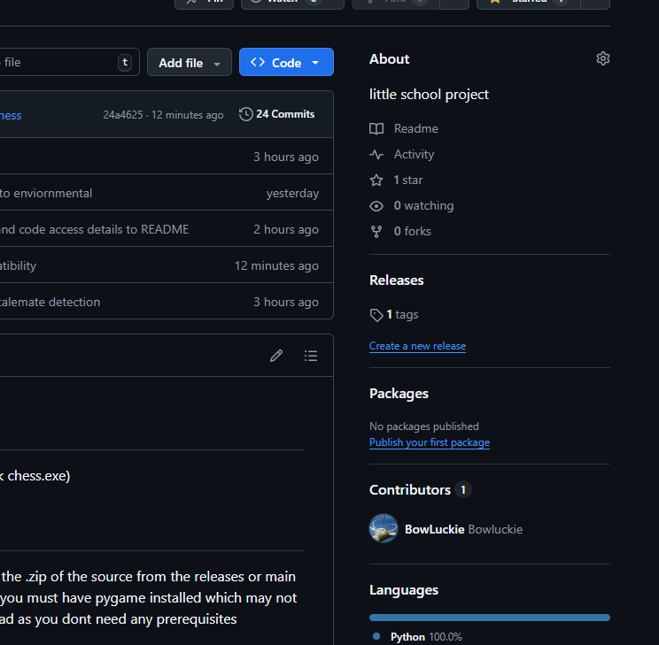

# to play the game

go to the release tab on the side and download the latest release (click chess.exe)

# to see the code
you can view my code directly from this website or you can download the .zip of the source from the releases or main page. 
be warned that in order to run the game directly from chess.py, you must have pygame installed which may not work on your version of python.
it is recomended to use the .exe instead as you dont need any prerequisites

